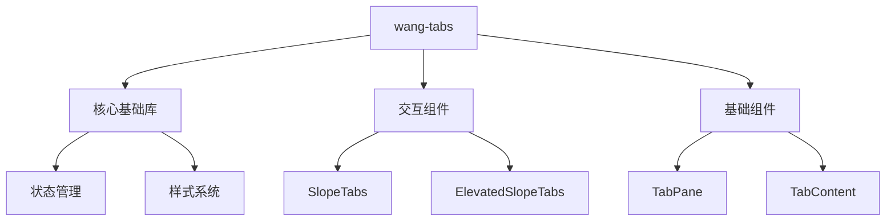

# 设计理念
---

`WangTabs` 以 **「简洁、灵活、高效」** 为核心设计原则，致力于为 React 开发者提供：
- **视觉一致性**：遵循现代设计规范，提供统一的交互体验
- **开发友好性**：通过 TypeScript 类型定义和清晰的 API 降低学习成本
- **扩展性**：模块化架构支持未来扩展更多组件


# 核心设计原则
| 原则           | 说明                                                                 |
|----------------|--------------------------------------------------------------------|
| **响应式设计** | 基于 CSS 弹性布局和 Rem 单位适配多端设备，提供一致的视觉表现                           |
| **无侵入式样式** | 所有组件样式均采用 CSS 变量和模块化设计，支持完全自定义主题                              |
| **动画优先**   | 默认提供平滑的 CSS 过渡动画，同时支持通过 React Spring 实现高级动画效果                  |
| **TypeScript 驱动** | 完整的类型定义和示例代码，确保代码安全性和开发效率                                   |


# 组件架构

---
# 样式系统
## 1. CSS 变量体系
通过 CSS 变量实现主题定制，所有组件共享以下基础变量：
```css
:root {
  --wang-tabs-font-size: 16px;
  --wang-tabs-active-color: #4096ff;
  --wang-tabs-border-radius: 8px;
  --wang-tabs-padding: 12px 24px;
}
```

## 2. 主题切换
```tsx
// 通过自定义 hook 实现主题切换
const useTheme = () => {
  const [theme, setTheme] = useState<'light' | 'dark'>('light');
  useEffect(() => {
    document.documentElement.className = `theme-${theme}`;
  }, [theme]);
  return { theme, setTheme };
};
```


# 未来规划
1. **组件扩展**
   - Q3 2025: 新增 `CardTabs` 卡片式选项卡
   - Q4 2025: 开发 `CollapsibleTabs` 折叠式选项卡
2. **功能增强**
   - 支持 SSR 服务端渲染
   - 增加 React Spring 动画预设
3. **生态建设**
   - 开发 Storybook 演示文档
   - 提供 Vue 3 版本适配


# 版本兼容性
| 环境       | 支持版本       |
|------------|-------------|
| React      | 18.x+       |
| TypeScript | 4.5+        |
| Node.js    | 16.x+       |